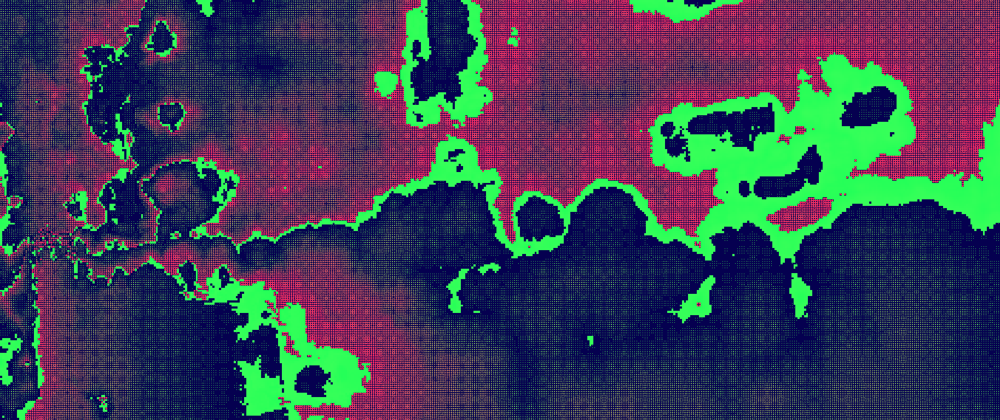
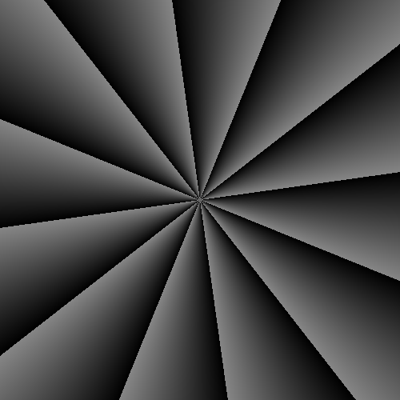
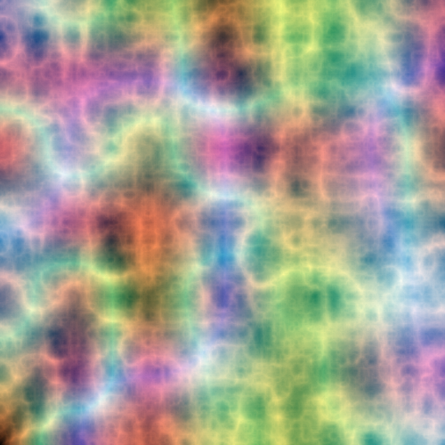
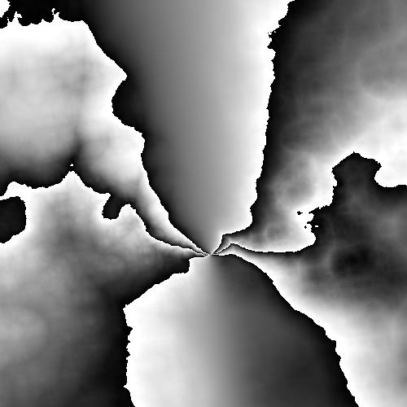
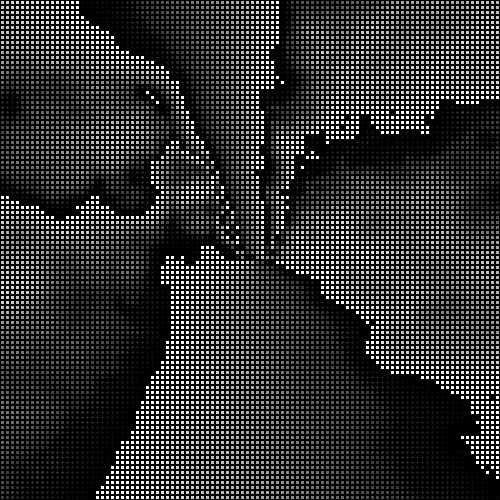
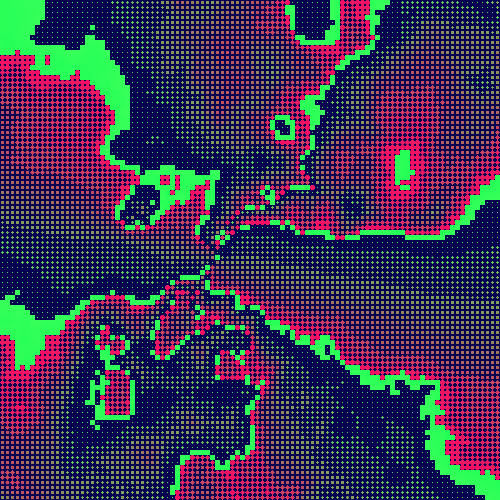
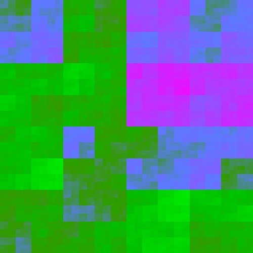

# Shaders de fragmento

<p align="center">
  
</p>

La práctica se divide en dos partes: el desarrollo del shader principal y la versión *tiny code* optimizada del shader propuesto. Todo el trabajo se ha realizado en el editor de [The Book of Shaders](https://thebookofshaders.com/) utilizando el lenguaje [GLSL](https://www.khronos.org/opengl/wiki/Core_Language_%28GLSL%29).

## Motivación

La idea principal del shader que quería hacer era generar una forma que rotara desde el centro y que pudiera distorsionarse dinámicamente a partir de una función de ruido. Durante la búsqueda de inspiración encontré dos Reels de Instagram de la cuenta `gela.js`, que publica demostraciones visuales realizadas con código.
En [uno de ellos](https://www.instagram.com/gela.js/reel/DNtj9q80FKW/), aparece un barrido con ruido alternando entre dos patrones distintos. En [el otro Reel](https://www.instagram.com/gela.js/reel/DP1xl7ejDpd/) se introducen además círculos en una malla y coloreados según la rotación de una función. A partir de estas ideas, quise usar el [ejemplo dado de barrido](https://github.com/otsedom/otsedom.github.io/tree/main/IG/S9#laboratorio-de-formas) para desplazar y deformar el centro a lo largo del tiempo mediante ruido.

## Desarrollo

La primera versión del shader parte del ejemplo inicial de “Efecto Molinillo” o barrido. El código se encuentra en [`mill-effect.glsl`](mill-effect.glsl). La función `rotate2d` permite rotar posiciones normalizadas `st` mediante un ángulo definido por $\sin(t)\pi$. El color depende del módulo entre el ángulo rotado y el número de divisiones del barrido.



Tras obtener el barrido base, el siguiente paso fue definir el tipo de ruido para distorsionarlo. El capítulo [Fractional Brownian Motion](https://thebookofshaders.com/13/) de **The Book Of Shaders** introduce distintas técnicas de ruido procedimental. Una opción especialmente interesante fue el ruido *Ridge*, una variante derivada del ruido Perlin en la que se usa el valor absoluto del ruido en cada octava.

El bucle del ruido Perlin estándar:

```glsl
for (int i = 0; i < OCTAVES; i++) {
    value += amplitude * noise(st);
    st *= 2.;
    amplitude *= .5;
}
```

Para generar un comportamiento similar al Ridge:

```glsl
for (int i = 0; i < OCTAVES; i++) {
    value += amplitude * abs(noise(st));
    st *= 2.;
    amplitude *= .5;
}
```

El **ruido Perlin** se genera interpolando gradientes pseudoaleatorios ubicados en las esquinas de cada celda, suavizando las transiciones mediante funciones como `smoothstep` y acumulando varias octavas escaladas para producir un patrón fractal complejo. Por su parte, el **ruido Ridge** intensifica las crestas y bordes que surgen del ruido Perlin al utilizar el valor absoluto del ruido en cada octava antes de acumularlo. Mi esperanza era que al combinar este tipo de ruido con la posición del píxel antes de aplicar la rotación, el shader resultara en un efecto visual llamativo.

También consulté otro recurso útil para comparar variantes de ruido: el tutorial *Noise Functions in Rendering* de GRASS GIS, disponible en [https://grass-tutorials.osgeo.org/content/tutorials/noise/noise.html](https://grass-tutorials.osgeo.org/content/tutorials/noise/noise.html), que muestra visualizaciones y variantes como Perlin, Ridge o multifractal.

El shader donde implemento la variante Ridge a partir del ejemplo de **The Book of Shaders** se encuentra en [`ridge-2d-noise.glsl`](ridge-2d-noise.glsl).



Una vez obtenido el tipo de ruido deseado, lo combiné con la rotación para distorsionar las coordenadas de entrada, generando un movimiento más orgánico. Esta integración aparece en [`rotate-ridge.glsl`](rotate-ridge.glsl).



Quise también recrear el efecto del segundo reel, en el que una cuadrícula de círculos cambia de color según el ruido. Para ello incorporé la función `circle` procedente de uno de los [ejemplos dados](https://github.com/otsedom/otsedom.github.io/tree/main/IG/S9#patrones-y-generativos) y discreticé la posición mediante `floor(pos * SCALE) / SCALE`. El código correspondiente está en [`circles-rotate-ridge.glsl`](circles-rotate-ridge.glsl).



La siguiente modificación consistió en hacer que el radio de los círculos dependiera del valor tras la rotación distorsionada, interpolando entre dos colores según la intensidad y usando un tercer color para el fondo. Esta variante está disponible en [`colored-circles-rotate-ridge.glsl`](colored-circles-rotate-ridge.glsl).



Ajustando diversos parámetros y añadiendo dependencia temporal adicional en la distorsión del ruido, llegué a la [versión final](end-result.glsl) previa a la fase de optimización:

<p align="center">
  
</p>

### Tiny-Code

Una vez completado el shader final, inicié un proceso de reducción del tamaño del código. Entre las técnicas usadas se encuentran: integración directa de funciones empleadas una única vez, simplificación algebraica de expresiones, renombrado de variables a un único carácter, reducción de precisión numérica y uso puntual de notación científica. Además se eliminaron todos los espacios y saltos de línea no esenciales.

El primer intento reducido está en [`tinycode/first-attempt.glsl`](tinycode/first-attempt.glsl) y ocupa 825 bytes, por lo que no alcanzaba el límite inferior de 512 bytes. Para cumplir con ese límite desarrollé un segundo shader alternativo, sin rotación 2D ni generación de círculos, y basado en un ruido Ridge simplificado que produce un patrón pixelado animado por bloques en el tiempo. El shader final reducido se encuentra en [`tinycode/second-attempt.glsl`](tinycode/second-attempt.glsl) y ocupa 364 bytes.



## Referencias

* gela.js – Reel sobre alternancia de ruido con un barrido: [https://www.instagram.com/gela.js/reel/DNtj9q80FKW/](https://www.instagram.com/gela.js/reel/DNtj9q80FKW/)
* gela.js – Reel sobre cuadrícula de círculos: [https://www.instagram.com/gela.js/reel/DP1xl7ejDpd/](https://www.instagram.com/gela.js/reel/DP1xl7ejDpd/)
* The Book of Shaders: [https://thebookofshaders.com](https://thebookofshaders.com)
* Editor de The Book of Shaders: [https://editor.thebookofshaders.com](https://editor.thebookofshaders.com)
* GLSL (OpenGL Shading Language): [https://www.khronos.org/opengl/wiki/Core_Language_(GLSL)](https://www.khronos.org/opengl/wiki/Core_Language_%28GLSL%29)
* Ejemplo de barrido utilizado: [https://github.com/otsedom/otsedom.github.io/tree/main/IG/S9#laboratorio-de-formas](https://github.com/otsedom/otsedom.github.io/tree/main/IG/S9#laboratorio-de-formas)
* Tutorial de ruido (GRASS GIS): [https://grass-tutorials.osgeo.org/content/tutorials/noise/noise.html](https://grass-tutorials.osgeo.org/content/tutorials/noise/noise.html)
* Sección de ruido Ridge: [https://grass-tutorials.osgeo.org/content/tutorials/noise/noise.html#ridge-noise](https://grass-tutorials.osgeo.org/content/tutorials/noise/noise.html#ridge-noise)
* OpenGL Reference Pages: [https://registry.khronos.org/OpenGL-Refpages/gl4/](https://registry.khronos.org/OpenGL-Refpages/gl4/)
* Documentación `mix()`: [https://registry.khronos.org/OpenGL-Refpages/gl4/html/mix.xhtml](https://registry.khronos.org/OpenGL-Refpages/gl4/html/mix.xhtml)

## Uso de inteligencia artificial generativa

Se utilizó IA generativa para tareas puntuales:

* Obtención de estrategias para minimizar el código del shader.
* Obtención de ejemplos y fragmentos de código para resolver problemas con WebGL.
* Corrección y formalización del texto del README.

---

Autor: Oliver Cabrera Volo
